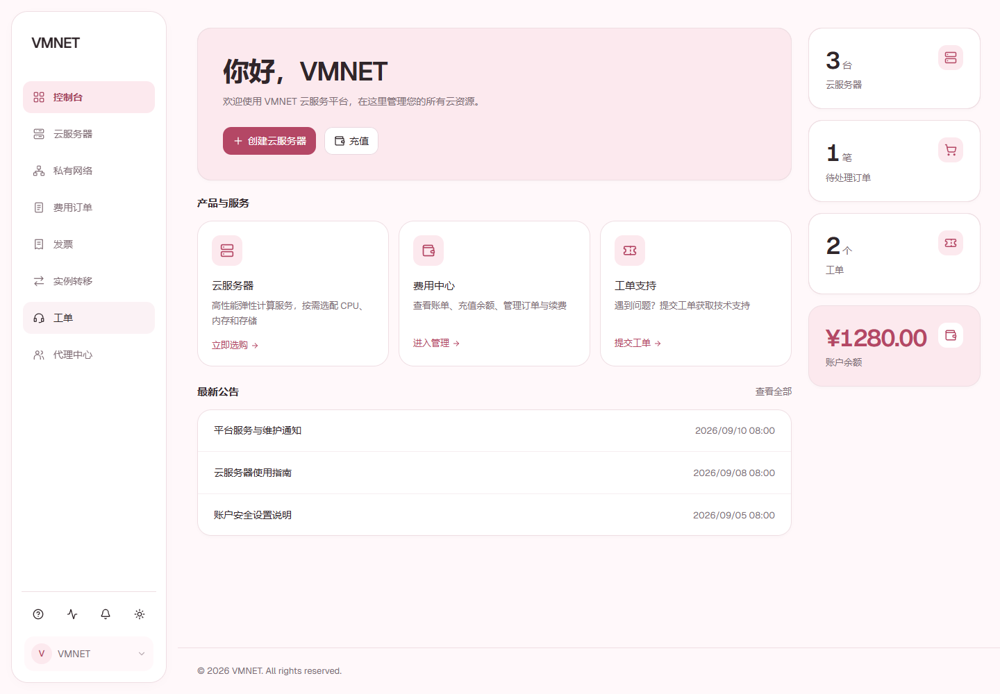
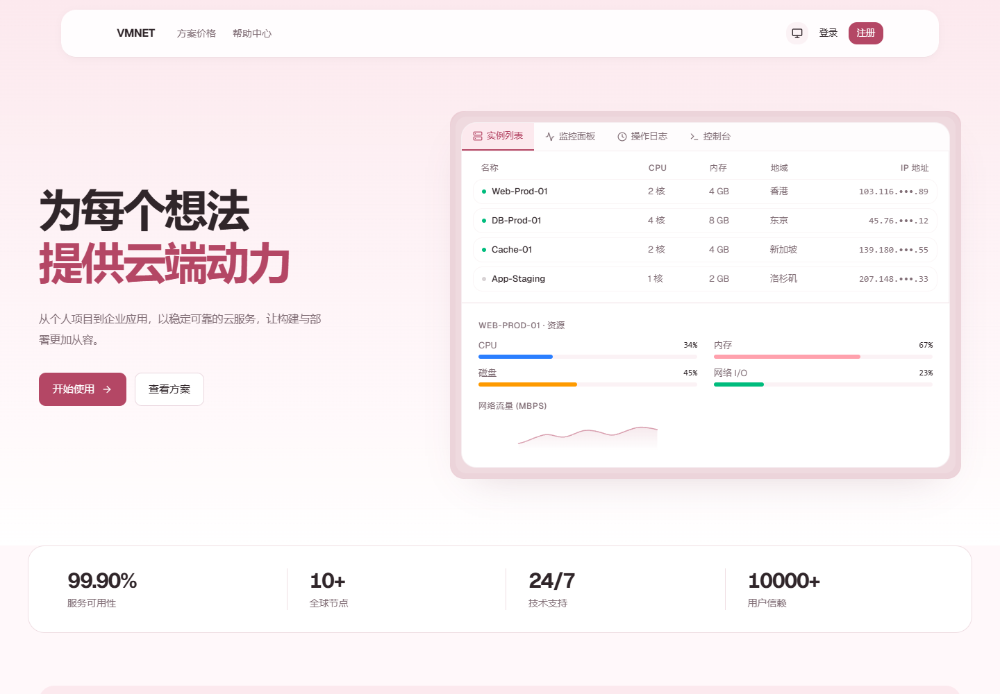

# Hero Pink

面向 **Novaix v0.4.2** 的淡粉色主题。以奶白、暖灰与玫瑰粉搭配门户侧栏和响应式首页，保留原有业务入口与操作流程。

> 这是基于 Novaix 官方前端定制的 **HeroUI 视觉风格主题**。组件实现沿用 React、Tailwind CSS 和 shadcn/ui / Radix UI，并非将项目整体迁移到 HeroUI 组件库。

## 效果预览

### 用户中心



### 访客首页



预览图使用模拟数据；站点名称、首页文案、套餐、公告等内容仍由你的面板配置和接口提供，不会被主题固定为截图中的内容。

## 布局与功能

- **用户中心**：电脑端左侧固定导航，账户、通知、主题切换等工具集中在侧栏下方；窄屏保留折叠菜单。
- **控制台**：欢迎区、服务卡片和公告重新排布，大屏右侧展示资源与余额统计。
- **首页**：左右分栏首屏、组合式功能卡片、纵向使用步骤与双栏 FAQ。
- **购买页**：配置区域与订单摘要分栏，桌面端摘要随滚动保持可见；小屏按顺序排列，不遮挡表单。
- **个人资料**：电脑端纵向分类，手机端横向分类，键盘方向键与视觉方向同步。
- **浅色 / 深色模式**：统一淡粉色细节，保留焦点、选中、禁用及错误状态。

主题修改集中在 `src/pages/portal/` 与 `src/pages/Home.tsx`。登录、套餐购买、订单、钱包、工单、实例管理等功能继续使用原有组件和接口。主题样式按页面挂载及卸载，不应用到管理后台或其他公共页面。

## 版本信息

| 项目 | 值 |
| --- | --- |
| 显示名称 | Hero Pink |
| 主题 ID | `hero-pink` |
| 当前版本 | `1.4.2` |
| Novaix 要求 | `~0.4.2`（`>=0.4.2` 且 `<0.5.0`） |
| 安装包 | `hero-pink.zip` |

本次更名也将主题 ID 从 `vmnet-theme` 改为 `hero-pink`。如果已安装旧版，面板会将 Hero Pink 识别为另一个主题；上传后选择并启用新主题即可。

版本约束不代表已验证后续所有补丁版本。本主题的 API 生成及构建基线为 Novaix **v0.4.2**；跨版本使用前应在测试面板验证。

## 下载与安装

无需本地构建即可安装：

1. 打开 [最新 Release](https://github.com/Grandova/Novxix-HeroUI-Pink-Theme/releases/latest)。
2. 在 **Assets** 中下载 **hero-pink.zip**，也可使用 [安装包直达链接](https://github.com/Grandova/Novxix-HeroUI-Pink-Theme/releases/latest/download/hero-pink.zip)。
3. 在 Novaix 后台 → 主题管理中上传安装，并启用 **Hero Pink**。

请下载 Release 附件中的主题包。GitHub 自动提供的 **Source code (zip / tar.gz)** 是源码，不能作为主题直接上传。Release 附件中的 **SHA256SUMS.txt** 可用于校验下载内容。

## 构建和打包

需要 **Node.js 22.12+** 和 **pnpm 10**。仓库已包含 v0.4.2 的公开接口定义，构建不需要向你的面板索取文档或读取账号数据。

```bash
git clone https://github.com/Grandova/Novxix-HeroUI-Pink-Theme.git
cd Novxix-HeroUI-Pink-Theme
pnpm install --frozen-lockfile
pnpm theme:build
```

`theme:build` 会依次执行：

1. 根据仓库内的 接口定义生成 `src/api/`。
2. 执行 TypeScript 检查与 Vite 生产构建。
3. 生成 `release/hero-pink.zip`。

打包脚本只使用 Node.js 内置模块，Windows、macOS、Linux 均不需要额外安装 `zip` 命令。

如已有最新的 `dist/`，可单独打包：

```bash
pnpm theme:pack
```

压缩包结构如下，没有多套一层项目目录：

```text
hero-pink.zip
├── theme.json
└── ui/
    ├── index.html
    └── assets/ ...
```

在 **Novaix 后台 → 主题管理 → 上传安装** 中选择 `release/hero-pink.zip`，然后启用 **Hero Pink**。上传的是构建后的主题 ZIP，不是 GitHub 的 “Download ZIP” 源码压缩包。

## 本地开发

```bash
pnpm install --frozen-lockfile
pnpm api:gen
pnpm dev
```

开发页面默认使用 `http://localhost:3000`，API 代理默认指向 `http://localhost:8080`。若后端地址不同，修改 `vite.config.ts` 中对应的代理目标。

生产请求使用同域 `/api/v1` 路径。正式使用时应作为 Novaix 主题安装，单独启动静态预览不会提供账号、套餐等后端数据。

如需使用其他版本的 API 定义，可显式覆盖输入：

```bash
# Bash
API_SCHEMA_INPUT=/path/to/api-schema.json pnpm api:gen
```

```powershell
# PowerShell
$env:API_SCHEMA_INPUT = 'C:\path\to\api-schema.json'
pnpm api:gen
```

更换接口定义后需重新构建、测试，并相应调整 `theme.json` 的 `requires`，不要仅修改版本约束绕过兼容检查。

## 有效源码与目录

```text
src/
├── pages/Home.tsx                  # 访客首页
├── pages/portal/                   # 门户页面和主题定制
│   ├── heroui-theme.css            # 基础色彩与组件样式
│   ├── vmnet-refinements.css       # 淡粉色细节（保留内部文件名）
│   ├── home-theme.css              # 首页样式与布局
│   ├── layout-redesign.css         # 门户侧栏和响应式布局
│   └── use-portal-theme.ts         # 主题作用域与响应式状态
├── components/, hooks/, lib/ ...   # 原有功能依赖
├── layouts/                       # 原有布局组件
└── api/                           # 自动生成，不提交
api-schema/novaix-v0.4.2.json          # 构建所需的公开 API 定义
api-client.config.ts              # API 客户端生成配置
scripts/package-theme.mjs          # 跨平台主题打包
public/                           # 必需的静态资源
theme.json                        # 主题名称、ID、版本及兼容要求
pnpm-lock.yaml                    # 固定依赖解析结果
```

仓库保留了完整路由和公共组件所依赖的前端源码，包括未定制的后台页面：当前官方前端统一构建，直接删除这些文件会导致路由或构建失效。

以下内容**不进入版本控制**：`node_modules/`、`dist/`、`src/api/`、`release/`、ZIP 安装包、日志、测试缓存、本地环境配置、面板凭据和旧版本备份。依赖目录体积大不等于主题源码体积大；克隆仓库不会附带这些本地文件。

## 验证范围

布局版本已执行生产构建、门户 34 项回归检查，以及首页与门户的多尺寸检查；另外验证了购买表单、套餐金额更新、短窗口侧栏、个人资料键盘切换和主题作用域清理。

浏览器检查使用模拟接口数据，未代替真实面板上的支付、创建实例或其他端到端业务验证。验证脚本中的模拟数据与临时截图未纳入源码仓库。

## 许可证与来源

主题仓库采用 [MIT License](LICENSE)。基于 [Novaix 官方前端](https://github.com/huohuastudio/novaix-ui) 定制，原始前端版权和 MIT 许可保留在 [LICENSES/Novaix-UI.txt](LICENSES/Novaix-UI.txt)。Novaix 发布项目见 [novaix-releases](https://github.com/huohuastudio/novaix-releases)。

`api-schema/novaix-v0.4.2.json` 来自 Novaix v0.4.2 官方发行程序提供的公开 API 文档，用于重建 API 客户端，不包含本地面板账号、令牌或业务数据。
